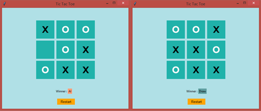

# A Perfect TicTacToe AI
An interactive TicTacToe game with an unbeatable AI player powered by the minimax algorithm and alpha-beta pruning

## Description
This project combines game theory and artificial intelligence techniques to create an unbeatable opponent for TicTacToe.

The AI player employs the minimax algorithm to explore all possible moves and select the best move based on the current game state. It utilizes alpha-beta pruning, a search optimization technique, to significantly reduce the number of evaluated game states and improve the AI's decision-making efficiency.

The project also includes a graphical user interface (GUI) developed using **Tkinter**, which provides a visually appealing game board. Players can enjoy playing against the AI and witnessing its strategic decision-making.

 

	

